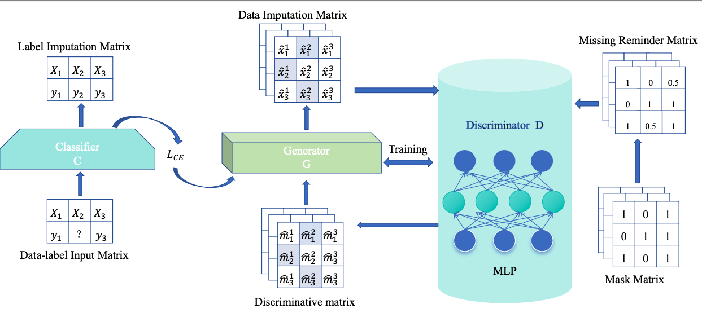

# SEGAN-A-Semi-Supervised-Learning-Method-for-Missing-Data-Imputation
This is the official repo for SEGAN paper.


> **SEGAN: A Semi Supervised Learning Method for Missing Data Imputation**  
> Xiaohua Pan\*,
> Weifeng Wu\*,
> [Peiran Liu](https://www.linkedin.com/in/peiran-liu1)\*,
> Guojun Sheng,
> Zhen Li,
> Peng Lu,
> Peijian Cao,
> Jianfeng Zhang,
> Xianfei Qiu,
> Yangyang Wu


[](https://www.arxiv.org/pdf/2405.13089)


<p align="center">
  
<br>
<br>

  
<em>In many practical real-world applications, data missing is a very common phenomenon,
making the development of data-driven artificial intelligence theory and technology
increasingly difficult. Data imputation is an important method for missing data
preprocessing. Most existing missing data imputation models directly use the known
information in the missing data set but ignore the impact of the data label information
contained in the data set on the missing data imputation model. In this paper, we
propose a missing data imputation model based on semi-supervised learning, named
SEGAN, which mainly includes three important modules: generator, discriminator, and
classifier. In the SEGAN model, the classifier enables the generator to make more full
use of known data and its label information when predicting missing data values. In
addition, the SEGAN model introduces a missing hint matrix to allow the discriminator
to more effectively distinguish between known data and data filled by the generator.
This paper theoretically proves that the SEGAN model that introduces a classifier and
a missing hint matrix can learn the real known data distribution characteristics when
reaching Nash equilibrium. Extensive experiments on three public real-world datasets
demonstrate that, SEGAN yields a more than 10% accuracy gain, compared with the
state-of-the-art approaches.</em>
</p>


## News

* [06/2024] Paper [SEGAN: A Semi-Supervised Learning Method for Missing Data Imputation](https://www.arxiv.org/pdf/2405.13089) released!
* [06/2024] Code [SEGAN](https://github.com/niunaicoke/SEGAN-A-Semi-Supervised-Learning-Method-for-Missing-Data-Imputation) released!


## BibTeX
If you use our work in your research, please cite our publication:
```
@article{pan2024segan,
  title={SEGAN: semi-supervised learning approach for missing data imputation},
  author={Pan, Xiaohua and Wu, Weifeng and Liu, Peiran and Li, Zhen and Lu, Peng and Cao, Peijian and Zhang, Jianfeng and Qiu, Xianfei and Wu, YangYang},
  journal={arXiv preprint arXiv:2405.13089},
  year={2024}
}
```
